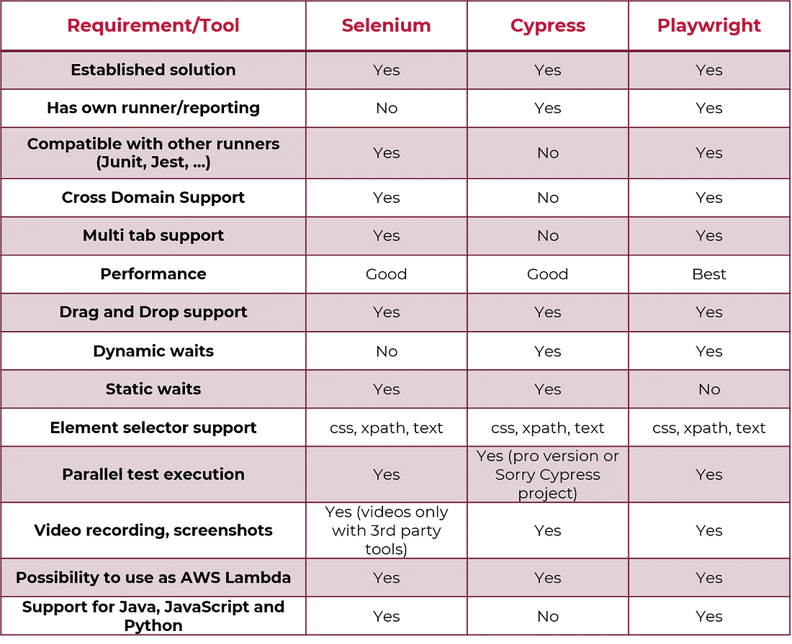

# playwright_automation_framework
## Playwright with cypress comparison



## playwright features
Cross-Browser Support
Language Agnostic
Fast and Reliable
Multiple Contexts
Parallel Execution
Headless and Headful Modes
Device Emulation
Automatic Waiting
API testing
Mocking 
Own test runner
Integration with CI/CD tools and cloud device like browserstack


## opening browser
const browser = await chromium.launch();

# generating automatic code using codegent
npx playwright codegen website

# RUNNING test in ui mode
npx playwright test --ui
npx playwright test 
npx playwright test --headed
npx playwright test --project webkit 
npx playwright test --project webkit --project firefox

# running specific tests
- To run a test with a specific title, use the -g flag followed by the title of the test.
   npx playwright test -g "add a todo item"
- npx playwright test landing-page.spec.ts
- npx playwright test tests/todo-page/

# running failed tests
npx playwright test --failed-only
npx playwright test --retries=3
npm run test --failed-only --retries 3

# running test parallel
1. npx playwright test --workers=4
2. workers: 4 in playwright config.ts


# debug test
npx playwright test --debug  //with playwright inspector
npx playwright test --ui
await page.pause()

# view report
npx playwright show-report

# handling dialogs alert popup 
```
page.on('dialog', async dialog => {
    console.log('Dialog message:', dialog.message());
    await dialog.accept(); // or dialog.dismiss() to dismiss the dialog
    await dialog.accept(promptText);
    dialog.type();  //Returns dialog's type, can be one of alert, beforeunload, confirm or prompt.
});
```
# handle multiple windows & handle multiple tabs
Each BrowserContext can have multiple pages. A Page refers to a single tab or a popup window
const pages = await context.pages();
// Create two pages
const pageOne = await context.newPage();
const pageTwo = await context.newPage();
// Get pages of a browser context
const allPages = context.pages();


const pagePromise = context.waitForEvent('page');
await page.getByText('open new tab').click();
const newPage = await pagePromise;

# Handling popups
const popupPromise = page.waitForEvent('popup');
await page.getByText('open the popup').click();
const popup = await popupPromise;
console.log(await popup.title());


# Browser Context
A browser context in Playwright represents an isolated browsing session within a browser
It encapsulates browser state, such as cookies, localStorage, and authentication sessions, and allows you to interact with multiple pages within that context.
Each browser context is isolated from others, meaning cookies, local storage, and other browser state are scoped to that context. Changes made in one context do not affect others.
Pages within the same context share the same browser state.

# Launching browser
- const { chromium } = require('playwright');  // Or 'firefox' or 'webkit'  with playwright 
 - test.beforeEach(async ({ browser }) => {
        practicePageContext = await browser.newContext();
});

# page goto and waitfor navigation
await page.goto(url)
await newPage.waitForURL(url, { waitUntil: 'load/networkidle/documentconnetloaded' });


# taking screenshot
await page.screenshot({ path: 'screenshot.png' });
screenshot: 'on/off/only-on-failure',
await page.screenshot({ path: 'screenshot.png', fullPage: true });
await page.locator('.header').screenshot({ path: 'screenshot.png' });

# selectors in playwright
css
xpath
textcontent await page.locator('article:has-text("Playwright")').click();
react
vue 

# cookies
await browserContext.cookies(); //Get Cookies
await browserContext.cookies(urls);

//clear cookies
await context.clearCookies();
await context.clearCookies({ name: 'session-id' });
await context.clearCookies({ domain: 'my-origin.com' });
await context.clearCookies({ domain: /.*my-origin\.com/ });
await context.clearCookies({ path: '/api/v1' });
await context.clearCookies({ name: 'session-id', domain: 'my-origin.com' });
//set cookeis
await page.setCookies([
    { name: 'cookieName', value: 'cookieValue', domain: 'example.com' },
    // Add more cookie objects as needed
]);

// Delete a specific cookie
await page.deleteCookie({ name: 'cookieName' });

// Clear all cookies
await page.clearCookies();

//modify cookies
const cookies = await page.cookies();
const modifiedCookies = cookies.map(cookie => {
    if (cookie.name === 'cookieName') {
        cookie.value = 'newValue';
    }
    return cookie;
});
await page.deleteCookie({ name: 'cookieName' });
await page.setCookies(modifiedCookies);


# wait for
locator.waitFor({ state: "visible/attached/detached/hidden" })


# Locator API
Locator API is a mechanism used to find and interact with elements on a web page. It provides a way to select elements based on various criteria such as CSS selectors, XPath expressions, text content, and more
Playwright's auto-waiting and retry-ability.

page.getByRole() to locate by explicit and implicit accessibility attributes.
page.getByText() to locate by text content.
page.getByLabel() to locate a form control by associated label's text.
page.getByPlaceholder() to locate an input by placeholder.
page.getByAltText() to locate an element, usually image, by its text alternative.
page.getByTitle() to locate an element by its title attribute.
page.getByTestId() to locate an element based on its data-testid attribute (other attributes can be configured).
await page.locator('css=button').click();
await page.locator('xpath=//button').click();

# permission
await context.grantPermissions(['clipboard-read']);
context.clearPermissions();

# Navigation commands
page.goBack()
page.goForward()
page.goto()
page.reload()
page.setContent()
page.waitForNavigation()

# Timeouts
setDefaultNavigationTimeout change the default maximum navigation time
setDefaultTimeout default maximum time for all the methods accepting timeout option
expectTimeout 


# Download
// Start waiting for download before clicking. Note no await.
const downloadPromise = page.waitForEvent('download');
await page.getByText('Download file').click();
const download = await downloadPromise;
// Wait for the download process to complete and save the downloaded file somewhere.
await download.saveAs('/path/to/save/at/' + download.suggestedFilename());
//cancel download
await download.cancel();

await download.createReadStream();
await download.delete();
await download.failure();
await download.path();
await download.saveAs('/path/to/save/at/' + download.suggestedFilename());


# handling file upload
// Start waiting for file chooser before clicking. Note no await.
const fileChooserPromise = page.waitForEvent('filechooser');
await page.getByText('Upload file').click();
const fileChooser = await fileChooserPromise;
await fileChooser.setFiles(path.join(__dirname, 'myfile.pdf'));

fileChooser.element(); //return file input element
fileChooser.isMultiple(); //if file upload accept multiple files
await fileChooser.setFiles(files);
await fileChooser.setFiles(files, options); // files string | Array<string> | Object | Array<Object>


# keyboard
await page.keyboard.type('Hello World!');
await page.keyboard.press('ArrowLeft');
await page.keyboard.down('Shift');
wait page.keyboard.up('Shift');
await page.keyboard.press('Shift+KeyA');


# locator

## click 
await page.locator('canvas').click({
    button:left/right/middle
    clickCount:2
    delay:
})
## handling multiple locator
for (const li of await page.getByRole('listitem').all())
  await li.click();

getAttribute
getByAltText

# How do you emulate a mobile device in Playwright?
- const context = await browser.newContext(playwright.devices['iPhone 11']);